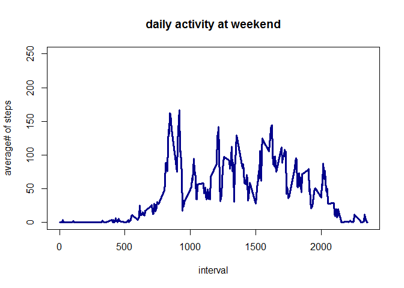

# Reproducible Research: Peer Assessment 1

## Loading and preprocessing the data
Here is the code needed to load the dataset (i.e. read.csv())

```r
setwd("/tmp/Coursera_RepRes/RepData_PeerAssessment1")

library(dplyr)
```

```
## Warning: package 'dplyr' was built under R version 3.1.2
```

```
## 
## Attaching package: 'dplyr'
## 
## The following object is masked from 'package:stats':
## 
##     filter
## 
## The following objects are masked from 'package:base':
## 
##     intersect, setdiff, setequal, union
```

```r
library(lattice)
library(tidyr)
library(lubridate)

if(!file.exists("activity.csv")){
  unzip("activity.zip")
}
activity<-read.csv("activity.csv" )
```

## What is mean total number of steps taken per day?
For this part of the assignment, you can ignore the missing values in the dataset.
Make a histogram of the total number of steps taken each day. Calculate and report the mean and median total number of steps taken per day

```r
activity <- transform(activity, date = factor(date))
activity<-group_by(activity, date)
sum_steps_day <- summarise(activity, steps = sum(steps))
sum_steps_day <- na.omit(sum_steps_day)
```
This histogram shows the total steps taken per day

```r
hist(sum_steps_day$steps, 
     main = "Total # steps per day", 
     xlab = "steps / day", 
     ylab = "frequency",
     col = "darkred")
```

 

#### Mean and median number of steps each day.

```r
options(scipen = 999)
mean_steps <- round(mean(sum_steps_day$steps, 
                   na.rm = TRUE), 
                   0)

print(paste("Mean steps:", 
            mean_steps), 
      sep = " ")
```

```
## [1] "Mean steps: 10766"
```

```r
median_steps <- round(median(sum_steps_day$steps, 
                       na.rm = TRUE), 
                      0)

print(paste("Median steps:", 
            median_steps), 
      sep = " ")
```

```
## [1] "Median steps: 10765"
```
The mean of steps per day is 10766, the median of steps is 10765.
NOTE: the dataset contains NAs. These NAs are not used in mean or median calculations.

## What is the average daily activity pattern?
Make a time series plot (i.e. type = "l") of the 5-minute interval (x-axis) and the average number of steps taken, averaged across all days (y-axis). Which 5-minute interval, on average across all the days in the dataset, contains the maximum number of steps?

Transform activity data:

```r
activity <- transform(activity, interval = factor(interval))
activity<-group_by(activity, interval)
mean_steps_interval <- summarise(activity, steps = mean(steps, na.rm=TRUE))
```

Plot average steps per interval:

```r
plot(levels(as.factor(mean_steps_interval$interval)), 
     mean_steps_interval$steps, 
     type = "l", 
     col = "darkred", 
     lwd = 3, 
     main = "daily activity", 
     xlab = "interval (hhmm)", 
     ylab = "average# steps")
```

 

#### 5-minute interval with maximum number of steps (averaged across all days)

```r
max_steps <- mean_steps_interval[match(max(mean_steps_interval$steps), 
                                       mean_steps_interval$steps),
                                 ]
```
Interval 835 contains the maximum steps. The average number of steps over all the days is: 206. 

## Imputing missing values
Note that there are a number of days/intervals where there are missing values (coded as NA). The presence of missing days may introduce bias into some calculations or summaries of the data.

Calculate and report the total number of missing values in the dataset (i.e. the total number of rows with NAs)

#### Number of rows with NAs

```r
number_na <- sum(is.na(activity))
```
The number of NAs in the data set is 2304. This is the same amount as the number of rows with NAs. The only column that contains missing values is "steps". 
The amount of NAs compared to the full dataset is: 13 %.

These calculated averages (steps per 5-min interval) are used to fill the missing step values. A new data set called "activity_noNAs" is created with the missing data filled in. 

```r
setwd("/tmp/Coursera_RepRes/RepData_PeerAssessment1")
activity_noNAs <- read.csv("activity.csv" )
class(activity_noNAs$interval) <- "numeric"
```

Lets create a new dataset that contains the original dataset plus the missing data.

```r
i = 1
for (i in 1 : dim(activity_noNAs)[1]){
        if (is.na(activity_noNAs[i,1])){
                r <- match(activity_noNAs[i, 3],
                         mean_steps_interval$interval)
                activity_noNAs[i, 1] <- mean_steps_interval[r, 2]
                }
        i = i + 1
}       
```

Make a histogram of the total number of steps taken each day and Calculate and report the mean and median total number of steps taken per day. Do these values differ from the estimates from the first part of the assignment? What is the impact of imputing missing data on the estimates of the total daily number of steps?

```r
sum_steps_day_noNAs <- tapply(activity_noNAs$steps, 
                              activity_noNAs$date, 
                              sum, 
                              na.rm = TRUE)
hist(sum_steps_day_noNAs, 
     main = "total# steps per day", 
     xlab = "#steps / day", 
     ylab = "frequency",
     col = "darkred")
```

 

#### Mean and median number of steps taken each day (no NAs) 

```r
mean_noNAs <- mean(sum_steps_day_noNAs)
print(paste("Mean:", mean_noNAs), sep = " ")
```

```
## [1] "Mean: 10766.1886792453"
```

```r
median_noNAs <- median(sum_steps_day_noNAs)
print(paste("Median:", median_noNAs), sep = " ")
```

```
## [1] "Median: 10766.1886792453"
```
The mean of steps per day is 10766 the median of steps is 10766. Mean and median value did not change compared to the calculation where the NAs were omitted in the data set. 

## Are there differences in activity patterns between weekdays and weekends?

```r
activity_noNAs <- mutate(activity_noNAs, 
                         date_day = wday(date))
activity_weekday <- subset(activity_noNAs, 
                           date_day>1 & date_day<7)
activity_weekday <- transform(activity_weekday, 
                              interval = factor(interval))
activity_weekday <- group_by(activity_weekday, 
                             interval)
mean_steps_interval_weekday <- summarise(activity_weekday, 
                                         steps = mean(steps, na.rm = TRUE))

activity_weekend <- subset(activity_noNAs,
                           date_day == 1 | date_day == 7)
activity_weekend <- transform(activity_weekend, 
                              interval = factor(interval))
activity_weekend <- group_by(activity_weekend, 
                             interval)
mean_steps_interval_weekend <- summarise(activity_weekend, 
                                         steps = mean(steps, 
                                                      na.rm=TRUE))

plot(levels(as.factor(mean_steps_interval_weekday$interval)), 
     mean_steps_interval_weekday$steps, 
     type = "l", 
     col = "darkred", 
     lwd = 3, 
     ylim = c(0,250),
     main = "daily activity at weekdays", 
     xlab = "interval", 
     ylab = "average# of steps")
```

 

```r
plot(levels(as.factor(mean_steps_interval_weekend$interval)), 
     mean_steps_interval_weekend$steps, 
     type = "l", 
     col = "darkblue", 
     lwd = 3, 
     ylim = c(0,250),
     main = "daily activity at weekend",
     xlab = "interval", 
     ylab = "average# of steps")
```

 
The figures show different daily activity patterns for weekdays and the weekend. During weekdays most activities are in the morning. The activities during the weekend are more distributed over the day.
